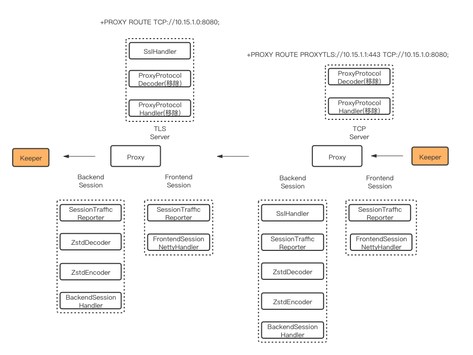
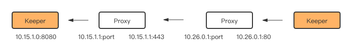

# 跨公网同步实施文档

## 背景
Redis的数据必须跨公网进行传输时，内网与公网进行连接传输大量数据，公网的不稳定性，不安全性在一定程度上决定了，使用 redis 直连进行同步是一项不推荐的方案。

通过搭建专线，可以解决上述问题，但是一方面，专线的费用昂贵; 另一方面，专线这种解决方案的可拓展性很差，每增加一个站点，就需要专门开通一条线路。

基于此，我们决定使用TCP Proxy的方案来解决Redis 数据跨公网同步的问题。具体项目代码在 xpipe 的 proxy 文件夹下面，XPipe Proxy 集中了加密，压缩的功能，同时，我们提供了对TCP算法的优化方案, 可以使得公网传输能够支持更大的带宽。

Proxy 连接关系如下图:


## 跨公网部署架构
XPipe 的组件中, 按照每个数据中心/站点 划分, 需求关系如下:

1. console 可以单站点部署, 也可以多站点部署
2. meta-server 每个站点至少有一台
3. keeper-container 每个站点至少有两台
4. proxy 每个站点至少有一台

如下图所示:


## 实施步骤
> 假设前提是用户已经将自己的XPipe系统基本搭建起来, 或者用户已经搭建成功内网的XPipe, 需要增加跨公网传输的功能, 请参照下面步骤搭建
> 

### 关于配置项
用户需要自己根据需求进行配置项调整, 下面就每一项进行说明:
配置文件在 config/xpipe.properties 中

#### Basic

```
proxy.frontend.tcp.port = 80     proxy 的内网端口
proxy.frontend.tls.port = 443    proxy 对公网的端口, 公网端口提供压缩加密功能, 内部通讯(内网则不用)

以下为 open ssl 证书的配置项, 按照自己需求配置
proxy.root.file.path = /opt/data/openssl/ca.crt
proxy.server.cert.chain.file.path = /opt/data/openssl/server.crt
proxy.client.cert.chain.file.path = /opt/data/openssl/client.crt
proxy.server.key.file.path = /opt/data/openssl/pkcs8_server.key
proxy.client.key.file.path = /opt/data/openssl/pkcs8_client.key

压缩算法使用ZSTD算法, 除非自己有需要, 可以自己改代码
proxy.response.timeout = 1000
proxy.compress.algorithm = ZSTD
proxy.compress.algorithm.version = 1.0


```

#### Advanced

```
proxy.no.tls.netty.handler = false    公网不加密的话, 配置为 true
proxy.internal.network.prefix = 192.168    内网IP Prefix, 防止外部IP链接 proxy 的内网端口 (因为内网端口是不经过加密的)
proxy.recv.buffer.size = 4096         netty 接收 buffer 大小参数, 除非对 netty 特别熟悉, 不要轻易修改这个参数
proxy.monitor.start = true            是否启用 proxy 监控, 如果没有监控系统可以关掉, 设置为 false
```

#### Optional

```
proxy.endpoint.check.interval.sec = 2    proxy 对 proxy 协议中下一跳的点进行健康监测的间隔, 可以不用调整
proxy.traffic.report.interval.milli = 5000  xpipe 向CAT打的监控埋点, 可以忽略
```

### TCP优化
在启动之前, 需要使用BBR算法替换 Linux 默认的 cubic 算法:

文章：https://www.vultr.com/docs/how-to-deploy-google-bbr-on-centos-7
    
下载内核安装包：http://mirror.rc.usf.edu/compute_lock/elrepo/kernel/el7/x86_64/RPMS/kernel-ml-4.9.0-1.el7.elrepo.x86_64.rpm  

```   
rpm -ivh XXX  
rpm -qa | grep kernel
sudo egrep ^menuentry /etc/grub2.cfg | cut -f 2 -d \'
sudo grub2-set-default 0  # 这里0需根据上个命令输出结果而定
sudo shutdown -r now
uname -r


echo 'net.core.default_qdisc=fq' | sudo tee -a /etc/sysctl.conf
echo 'net.ipv4.tcp_congestion_control=bbr' | sudo tee -a /etc/sysctl.conf
sudo sysctl -p
```

### Java 启动TCP在80端口

```
setcap 'cap_net_bind_service=+ep' $JAVE_HOME/bin/java
```

### 初始化脚本

redis/redis-proxy/src/main/test/resources下包含cert和env_set文件夹，将2个文件夹复制到Proxy机器上，在完成内核手动升级后，执行如下命令完成机器初始化。
```
sudo bash init.sh && sudo bash refresh.sh
```

### 数据库插入信息

#### proxy节点的插入
通过调用 console api, 可以完成 proxy 节点的插入:
url: `http://{xpipe-url}/api/proxy`
method: `POST`添加/`PUT`修改
body:
```
{
	"uri": "192.168.0.1:80",
	"dcName": "jq",
	"active": true,
	"monitorActive": false
}
```

#### route节点的插入
> route 定义了 proxy 和 proxy 之前的链接, 用户通过添加 route, 来控制不同站点之间的访问路径

通过调用 console api, 可以完成 route 节点的插入:
url: `http://{xpipe-url}/api/route`
method: `POST`添加/`PUT`修改
body:
```
{
	"srcProxyIds": "1,2,3",     //源地址的 proxy id 列表, 逗号间隔
	"dstProxyIds": "4,5,6",     //目的地的 proxy id 列表, 逗号间隔
	"optionProxyIds": "",        //proxy 支持中间跳转, 如果没有必要, 可以不填
	"srcDcname": "jq",      //源机房名称, 校验信息时会使用
	"dstDcname": "oy",      //目标机房名称, 校验信息时会使用
	"tag": "meta"
}
```

特别注意 "tag" 这一项实际控制了 route 的用途, 目前支持两种 tag
`meta` 或者 `console`
`meta` 是 keeper 之间用来同步的, meta server 对不同的标记为`meta`的路由进行选择, 发送给 keeper, 告知具体路径
`console` 是为了 console 跨公网对 redis 做健康检测时, 需要经过 proxy 转发


### 小结
到此, 用户可以使用 proxy 提供的跨公网传输的功能, 携程目前使用 proxy 进行从上海到德国的数据传输, 稳定性和安全性都经过生产环境的检验

# Proxy 整体设计


proxy 会在80和443分别启动服务，80端口服务内网连接，443端口服务外网连接。

## 核心概念

### Tunnel
网络隧道，隧道有入口和出口，分别映射到内网和外网，所以 Tunnel 的作用就是将 内网/外网 流量转到 外网/内网。

### Session
一段连接回话，具有生命周期，包含Init、Established、Closing和Closed。

### ProxyProtocol
为了保证 proxy 本身是无状态的，使用 proxy 的 client 需要将整条链路上经过的所有 proxy 与 server 的 IP 和端口作为一条信息发送给连接的 proxy，此条消息即 proxy 协议中 route 信息。

数据在公网传输时，proxy 需要进行 ssl 加密，使用443端口，在 proxy 协议中 URI 为 PROXYTLS:后接IP与端口，即 PROXYTLS:IP:443；

而在内网传输时，不必进行 ssl 加密，使用80端口，在 proxy 协议中 URI 为 TCP:后接IP与端口，即 TCP:IP:80。

URI构成格式如下所示：


# Proxy Client
redis-proxy-client 客户端提供了低侵入 proxy 接入方式，用户注册需要代理的终端，运行时客户端自动拦截建连请求，完成 proxy 通信协议，实现用户数据传输。

## 使用方式

### 引入依赖

```
<!-- 最低版本1.2.4 -->
<dependency>
    <groupId>com.ctrip.framework.xpipe.redis</groupId>
    <artifactId>redis-proxy-client</artifactId>
    <version>${project.version}</version>
</dependency>
```

### 注册代理终端
注册需要代理的 (ip, port) 及其使用的 proxy 信息即可。
```
ProxyRegistry.registerProxy("10.15.1.0", 8080, "PROXY ROUTE PROXYTCP://10.26.0.1:80 PROXYTLS://10.15.1.1:443 TCP")

```
运行时，keeper 会自动建立如下链路，proxy 对用户完全透明。


### 取消代理终端
```
ProxyRegistry.unegisterProxy("10.15.1.0", 8080)

```

## 实现原理
redis-proxy-client 使用 JavaAgent 和 ASM 字节码技术，对JVM加载的 Socket.class 和 SocketChannelImpl.class 二进制文件，利用 ASM 动态修改对应的 class 文件，代理实现 proxy 协议。

### Agent启动
1. 使用 Tomcat 容器的启动 war 包的应用，通过 ServletContextListener 实现 Agent 的自动启动；
2. 使用 Spring Boot 启动 jar 包的应用，通过 EnableAutoConfiguration 实现 Agent 的自动启动;
3. 非以上2种方式，可以主动执行 ProxyAgentTool.startUp() 启动 Agent。

对于 jdk >= 9 的应用，需添加如下 VM 参数：
```
-Djdk.attach.allowAttachSelf=true
```